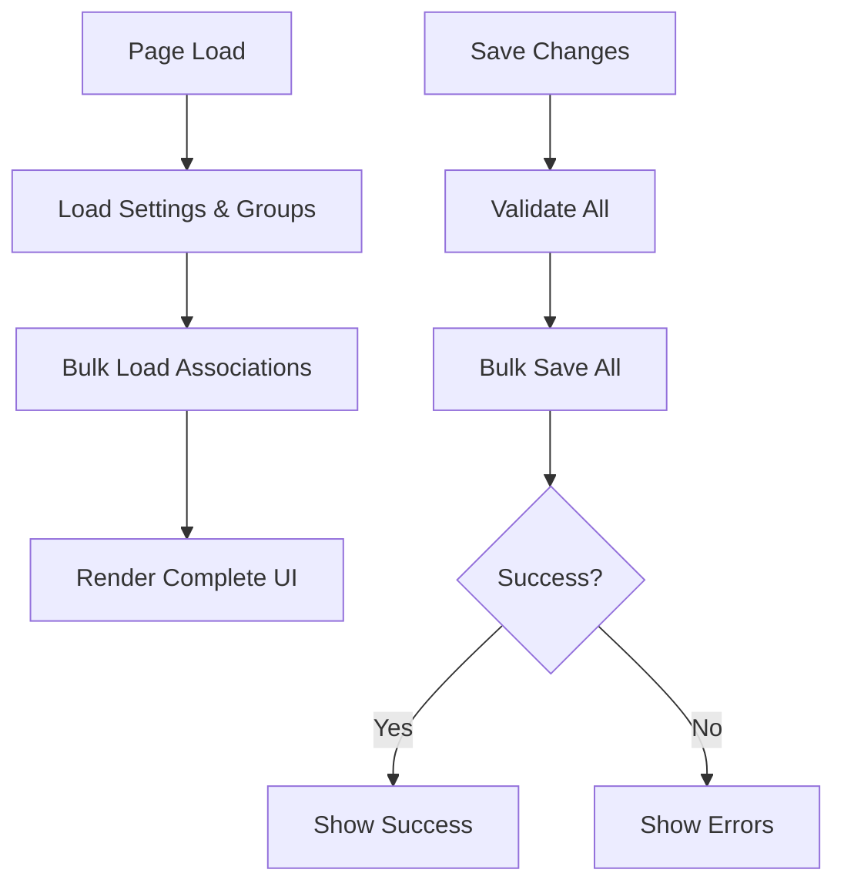

# Service Items Settings Performance Optimization - Business Logic & Technical Design

## Overview

This document analyzes the critical performance issue with the Service Items Settings feature and provides a comprehensive plan to resolve the database connection pool exhaustion and slow load/save times. The current implementation makes excessive API calls during page load and save operations, causing database connection timeouts and poor user experience.

**Key Goals:**
- Reduce database connection pool exhaustion
- Eliminate N+1 query patterns during loading
- Optimize save operations to be more efficient
- Maintain data consistency and user experience
- Implement proper caching and bulk loading strategies

---

## Key Business Logic

### 1. Current Performance Problem

**Database Connection Pool Exhaustion**: The service items settings page currently makes an excessive number of concurrent API calls during loading:

- 1 call for clinic settings (appointment types)
- 1 call for service type groups
- 1 call for practitioners (members)
- N×M calls for billing scenarios (N=service items, M=practitioners per service)
- N calls for resource requirements (N=service items)
- N calls for follow-up messages (N=service items)

**Example Impact**: With 20 service items and 3 practitioners each, this results in ~104 concurrent API calls, each requiring a database connection.

**Rationale**: The current architecture doesn't scale with the number of service items and practitioners, causing timeouts when the database connection pool (size 5) is exhausted.

### 2. Data Loading Requirements

**Atomic Data Loading**: All service item associations must be loaded together to prevent UI rendering with incomplete data:

- Practitioner assignments (which practitioners offer which services)
- Billing scenarios (pricing per practitioner-service combination)
- Resource requirements (equipment/facilities needed per service)
- Follow-up messages (automated messages after appointments)

**Rationale**: Loading associations separately causes timing gaps where the UI renders with empty data, leading to poor user experience and potential data loss.

### 3. Save Operation Complexity

**Multi-Step Save Process**: Current save operation performs sequential steps:
1. Save groups
2. Save service items
3. Save practitioner assignments
4. Save billing scenarios
5. Save resource requirements
6. Save follow-up messages

**Transaction Boundaries**: Each step currently uses separate database transactions, risking partial saves on failures.

**Rationale**: Complex save operations hold database connections open for extended periods, contributing to pool exhaustion.

---

## Backend Technical Design

### API Endpoints

#### Current Endpoints (Problematic)
- `GET /clinic/settings` - Loads appointment types
- `GET /clinic/service-type-groups` - Loads groups
- `GET /clinic/members` - Loads practitioners
- `GET /clinic/service-items/{service_item_id}/practitioners/{practitioner_id}/billing-scenarios` - Individual billing scenarios
- `GET /clinic/appointment-types/{appointment_type_id}/resource-requirements` - Individual resource requirements
- `GET /clinic/appointment-types/{appointment_type_id}/follow-up-messages` - Individual follow-up messages

#### New Bulk Endpoints (Solution)

##### `GET /clinic/service-items/associations/bulk`
- **Description**: Bulk load all service item associations in a single request
- **Parameters**:
  - `service_item_ids` (optional): Filter to specific service items
  - `include_billing_scenarios` (boolean, default: true)
  - `include_resource_requirements` (boolean, default: true)
  - `include_follow_up_messages` (boolean, default: true)
- **Response** (Flattened Structure for Frontend Usability):
```json
{
  "associations": [
    {
      "service_item_id": 1,
      "practitioner_assignments": [101, 102, 103],
      "billing_scenarios": {
        "101": [
          {
            "id": 1,
            "name": "Standard Rate",
            "amount": 1000,
            "revenue_share": 800,
            "is_default": true
          }
        ],
        "102": [
          {
            "id": 2,
            "name": "Premium Rate",
            "amount": 1500,
            "revenue_share": 1200,
            "is_default": false
          }
        ]
      },
      "resource_requirements": [
        {
          "id": 10,
          "resource_type_id": 1,
          "resource_type_name": "Massage Table",
          "quantity": 1
        }
      ],
      "follow_up_messages": [
        {
          "id": 20,
          "timing_mode": "hours_after",
          "hours_after": 24,
          "message_template": "How was your treatment?",
          "is_enabled": true,
          "display_order": 1
        }
      ]
    }
  ]
}
```

**API Design Rationale**:
- **Flattened by Service Item**: Frontend can easily iterate through service items
- **Nested by Practitioner**: Billing scenarios naturally group by practitioner-service combinations
- **Array Structure**: Easier for React state management and mapping operations
- **Consistent IDs**: All entities include their IDs for update operations
- **Errors**: Standard clinic access errors

##### `POST /clinic/service-items/associations/bulk-save`
- **Description**: Bulk save all service item associations in a single transaction
- **Request Body**:
```json
{
  "practitioner_assignments": {
    "service_item_id_1": [practitioner_id_1, practitioner_id_2]
  },
  "billing_scenarios": {
    "service_item_id_1-practitioner_id_1": [
      {
        "name": "Standard Rate",
        "amount": 1000,
        "revenue_share": 800,
        "is_default": true
      }
    ]
  },
  "resource_requirements": {
    "service_item_id_1": [
      {
        "resource_type_id": 1,
        "quantity": 1
      }
    ]
  },
  "follow_up_messages": {
    "service_item_id_1": [
      {
        "timing_mode": "hours_after",
        "hours_after": 24,
        "message_template": "How was your treatment?",
        "is_enabled": true,
        "display_order": 1
      }
    ]
  }
}
```
- **Response**: Success confirmation with created/updated IDs
- **Errors**: Validation errors, transaction rollback on failure

### Database Schema

**Current Schema**: No changes needed - existing tables remain:
- `appointment_types` (service items)
- `service_type_groups`
- `practitioner_appointment_types` (assignments)
- `billing_scenarios`
- `appointment_resource_requirements`
- `follow_up_messages`

### Business Logic Implementation

#### New Bulk Service Layer

**BulkAssociationService**: New service class for bulk operations:

```python
class BulkAssociationService:
    @staticmethod
    def load_all_associations(db: Session, clinic_id: int, service_item_ids: Optional[List[int]] = None) -> Dict[str, Any]:
        """Load all associations for service items in optimized queries"""

    @staticmethod
    def save_all_associations(db: Session, clinic_id: int, data: Dict[str, Any]) -> Dict[str, Any]:
        """Save all associations in a single transaction"""
```

**Optimization Strategies**:
- Use `selectinload` for eager loading of related data
- Single queries with `WHERE IN` clauses instead of N individual queries
- Batch insert/update operations
- Single transaction for all operations

#### Database Connection Pool Configuration

**Conservative Pool Size Increase**:
```python
engine = create_engine(
    DATABASE_URL,
    pool_pre_ping=True,
    pool_recycle=DB_POOL_RECYCLE_SECONDS,
    pool_size=10,          # Increased from default 5 (100% increase)
    max_overflow=15,       # Reduced from default 10 to 15 (50% increase)
    pool_timeout=30,       # Keep existing timeout
)
```

**Technical Analysis - Why NOT Maximum Pool Size**:

**Database Server Limits**: PostgreSQL default `max_connections` is typically 100-200, but production deployments often limit to 20-50 connections per application to prevent resource exhaustion.

**Memory Overhead**: Each connection consumes ~2-10MB of RAM on the database server. With 50+ connections, this could consume 100-500MB just for connection overhead.

**Connection Contention**: More connections increase lock contention and reduce query parallelism. The database can only execute a limited number of queries concurrently regardless of connection count.

**Resource Waste**: Idle connections still consume server resources. With proper bulk loading, we should need far fewer connections.

**Current vs. Proposed Usage**:
- **Current**: 100+ concurrent connections during peak loads
- **Target**: <15 connections with bulk operations
- **Pool Size 10+15**: Provides headroom for unexpected load while preventing resource waste

**Alternative: Application-Level Connection Pooling**:
Consider implementing connection pooling at the application level using tools like:
- SQLAlchemy's `QueuePool` (already in use)
- PgBouncer for external connection pooling
- Database connection multiplexing

**Monitoring Strategy**:
```python
# Add to database monitoring
connection_pool_metrics = {
    'pool_size': engine.pool.size(),
    'checked_out': engine.pool.checkedout(),
    'overflow': engine.pool.overflow(),
    'invalid': engine.pool.invalid(),
}
```

**Scaling Strategy**:
1. **Phase 1**: Implement bulk operations (should reduce connections by 80-90%)
2. **Phase 2**: Monitor actual usage for 2 weeks
3. **Phase 3**: Adjust pool size based on metrics (not assumptions)
4. **Phase 4**: Consider auto-scaling pool size based on load patterns

---

## Risk Assessment

### Technical Risks

#### Database Connection Pool Exhaustion (Critical)
- **Risk**: Bulk operations could still trigger connection pool issues if not properly optimized
- **Mitigation**:
  - Implement query result streaming for large datasets
  - Add connection pool monitoring with alerts
  - Rollback plan: Revert to individual API calls if bulk operations fail
  - Load testing with 1000+ service items before production deployment

#### Transaction Deadlocks (High)
- **Risk**: Bulk save operations could cause deadlocks with concurrent user operations
- **Mitigation**:
  - Use `SELECT FOR UPDATE` with consistent ordering
  - Implement retry logic with exponential backoff
  - Monitor deadlock frequency in staging environment
  - Transaction timeout: 30 seconds maximum

#### Memory Usage Spikes (Medium)
- **Risk**: Loading all associations for large clinics could cause memory issues
- **Mitigation**:
  - Implement pagination for clinics with >500 service items
  - Stream processing for bulk operations
  - Memory monitoring with automatic fallback to individual loading

#### Data Consistency Issues (Medium)
- **Risk**: Partial bulk operation failures could leave data in inconsistent state
- **Mitigation**:
  - Single transaction for all bulk operations
  - Comprehensive rollback on any failure
  - Pre-validation of all data before transaction start
  - Audit logging for all bulk operations

### Operational Risks

#### Performance Regression (Medium)
- **Risk**: Bulk operations could be slower than individual calls for small datasets
- **Mitigation**:
  - Automatic fallback to individual loading for <10 service items
  - A/B testing with performance monitoring
  - Feature flag for gradual rollout

#### Increased Database Load (Low)
- **Risk**: Bulk queries could increase database CPU and I/O usage
- **Mitigation**:
  - Query optimization with proper indexing
  - Database monitoring and query performance analysis
  - Load testing under various data sizes

### Rollback Strategy

#### Phase Rollback (Per Phase)
- **Phase 1**: Disable bulk endpoints, revert to individual APIs
- **Phase 2**: Feature flag rollback to original loading logic
- **Phase 3**: Database configuration rollback if connection issues persist
- **Phase 4**: Complete reversion with monitoring data for future attempts

#### Emergency Rollback (Production Incident)
1. **Detection**: Monitor error rates (>5%) and response times (>10s)
2. **Isolation**: Use feature flags to disable bulk operations per clinic
3. **Recovery**: Automatic fallback to individual API calls
4. **Analysis**: Log analysis to identify root cause
5. **Fix**: Deploy hotfix within 1 hour for critical issues

---

## Monitoring & Metrics

### Database Connection Pool Metrics
```python
# Real-time monitoring
pool_metrics = {
    'active_connections': engine.pool.checkedout(),
    'available_connections': engine.pool.size() - engine.pool.checkedout(),
    'overflow_connections': engine.pool.overflow(),
    'connection_wait_time': engine.pool._timeout,
    'connection_failures': failure_counter
}
```

### Application Performance Metrics
- **Page Load Time**: Target <3 seconds for 50+ service items
- **API Response Time**: Target <2 seconds for bulk operations
- **Concurrent Connections**: Target <15 peak connections
- **Error Rate**: Target <1% for bulk operations
- **Memory Usage**: Monitor application memory during bulk operations

### Database Performance Metrics
- **Query Execution Time**: Monitor bulk query performance
- **Connection Pool Utilization**: % of pool in use over time
- **Transaction Duration**: Bulk save transaction times
- **Deadlock Frequency**: Monitor and alert on deadlocks

### User Experience Metrics
- **Time to Interactive**: Measure when UI becomes responsive
- **Error Recovery**: % of users who successfully recover from errors
- **Feature Adoption**: % of clinics using bulk operations successfully

### Alerting Strategy
```python
# Critical alerts
if pool_overflow > 10:
    alert("Database pool overflow critical")

if bulk_operation_time > 10:
    alert("Bulk operation performance degradation")

if error_rate > 0.05:
    alert("Bulk operation error rate high")

# Warning alerts
if pool_utilization > 0.8:
    warn("High database pool utilization")

if response_time > 5:
    warn("Slow response time detected")
```

---

## Frontend Technical Design

### State Management Strategy

#### Server State (API Data)

- [ ] **Data Source**: New bulk endpoints provide all association data
- [ ] **React Query Hooks**:
  - `useServiceItemsAssociationsBulkQuery()` - Bulk load all associations
  - `useServiceItemsAssociationsBulkMutation()` - Bulk save all associations
- [ ] **Query Keys**:
  - `['service-items', 'associations', 'bulk', clinicId]`
  - `['service-items', 'associations', 'bulk', clinicId, serviceItemIds]` (filtered)
- [ ] **Cache Strategy**:
  - `staleTime`: 5 minutes (associations change infrequently)
  - `cacheTime`: 30 minutes (keep in cache longer for performance)
  - Invalidation triggers: After save operations, clinic switching

#### Client State (UI State)

- [ ] **Zustand Store**: Extend `useServiceItemsStagingStore`
  - New method: `bulkLoadAssociations()` - Load all associations at once
  - New method: `bulkSaveAssociations()` - Save all associations at once
- [ ] **Local Component State**: Minimal changes needed

#### Form State

- [ ] **React Hook Form**: No changes needed - existing form handling remains

### Component Architecture

#### Component Hierarchy
```
SettingsServiceItemsPage
├── ServiceItemsTable (existing)
├── ServiceItemEditModal (existing)
│   ├── PractitionerAssignmentSection (existing)
│   ├── BillingScenariosSection (existing)
│   ├── ResourceRequirementsSection (existing)
│   └── FollowUpMessagesSection (existing)
└── ServiceTypeGroupManagement (existing)
```

#### Component List

- [ ] **SettingsServiceItemsPage** - Main page component
  - Props: Existing props
  - State: Add bulk loading state
  - Dependencies: New bulk query hooks

- [ ] **BulkAssociationLoader** - New utility component for loading all associations
  - Props: `serviceItemIds`, `onDataLoaded`
  - State: Loading states
  - Dependencies: Bulk query hook

### User Interaction Flows

#### Flow 1: Page Load (Optimized)
1. User navigates to Service Items Settings
2. Page loads clinic settings and groups (existing calls)
3. **New**: Single bulk API call loads ALL associations
4. UI renders with complete data immediately
5. No additional loading states or timing gaps

#### Flow 2: Save All Changes (Optimized)
1. User clicks "儲存變更" (Save Changes)
2. Validation runs (existing)
3. **New**: Single bulk save API call saves all associations
4. All operations in single transaction
5. Success/error feedback to user

#### Mermaid Diagram


### Edge Cases and Error Handling

#### Edge Cases
- [x] **Partial Bulk Load Failure**: If bulk load partially fails, fall back to individual loads for missing data
- [x] **Bulk Save Failure**: Transaction rollback ensures no partial saves
- [x] **Large Dataset**: Implement pagination/virtualization if >100 service items
- [x] **Network Interruption**: Retry logic with exponential backoff
- [x] **Clinic Switching**: Clear all caches when clinic changes

#### Error Scenarios
- [x] **Bulk Load Timeout**: Show partial data with retry option
- [x] **Bulk Save Timeout**: Show transaction rollback message with detailed error breakdown
- [x] **Partial Bulk Failure**: Graceful degradation - load remaining data individually
- [x] **Transaction Deadlock**: Automatic retry with exponential backoff (up to 3 attempts)
- [x] **Memory Limit Exceeded**: Fallback to paginated loading for large datasets
- [x] **Network Interruption**: Resume interrupted operations with progress tracking
- [x] **Validation Errors**: Show field-level errors for failed associations with navigation to problematic items
- [x] **Loading States**: Skeleton loading for initial bulk load with progress indicators
- [x] **Mutation States**: Optimistic updates during bulk save with rollback on failure
- [x] **Concurrent Edit Conflicts**: Merge conflict resolution with user choice to override or cancel

### Testing Requirements

#### E2E Tests (Playwright)
- [ ] **Bulk Loading Performance**: Verify page loads in <3 seconds with 50 service items
- [ ] **Bulk Save Operation**: Verify all associations save correctly
- [ ] **Error Recovery**: Verify fallback to individual loads on bulk failure
- [ ] **Large Dataset**: Test with 100+ service items
- [ ] **A/B Testing**: Verify feature flag controls bulk vs individual loading

#### Integration Tests (MSW)
- [ ] **Bulk API Mocking**: Mock bulk endpoints and verify UI behavior
- [ ] **Error Scenarios**: Mock API failures and verify error handling
- [ ] **Partial Failures**: Mock partial bulk failures and verify fallbacks
- [ ] **Concurrent Operations**: Test multiple users editing simultaneously

#### Unit Tests
- [ ] **BulkAssociationService**: Test bulk loading and saving logic
- [ ] **Bulk Query Hook**: Test React Query integration
- [ ] **Bulk Mutation Hook**: Test save operations and error handling
- [ ] **Connection Pool Monitoring**: Test pool usage metrics

### Performance Considerations

- [ ] **Data Loading**: Single bulk request instead of 100+ individual requests
- [ ] **Caching**: 5-minute stale time for association data
- [ ] **Optimistic Updates**: Update UI immediately on save, rollback on failure
- [ ] **Lazy Loading**: No lazy loading needed - bulk load is fast enough
- [ ] **Memoization**: Memoize association data processing
- [ ] **Connection Pool Monitoring**: Track pool usage and optimize based on real data

---

## Integration Points

### Backend Integration
- [ ] New bulk service methods
- [ ] Updated database pool configuration
- [ ] Transaction management for bulk operations
- [ ] Connection pool monitoring and metrics

### Frontend Integration
- [ ] Extended Zustand store with bulk methods
- [ ] New React Query hooks with feature flags
- [ ] Updated component loading logic with A/B testing
- [ ] Maintained compatibility with existing edit modals

---

## Security Considerations

- [ ] Authentication requirements: Admin role required for settings changes
- [ ] Authorization checks: Clinic access validation on all endpoints
- [ ] Input validation: Pydantic models validate all bulk data
- [ ] XSS prevention: Input sanitization on message templates
- [ ] CSRF protection: Existing FastAPI security measures
- [ ] Rate limiting: Prevent abuse of bulk endpoints

---

## Migration Plan & Rollout Strategy

### A/B Testing Strategy
**Test Groups**:
- **Control Group (A)**: 20% of clinics continue using individual API calls
- **Test Group (B)**: 80% of clinics use bulk operations
- **Metrics Comparison**: Page load time, error rates, user satisfaction

**Test Duration**: 2 weeks minimum to capture different usage patterns

**Success Criteria**:
- 50%+ improvement in page load time
- <2% increase in error rates
- No database connection pool issues
- Positive user feedback

### Gradual Rollout Strategy

#### Phase 1: Backend Implementation (Week 1-2)
- [x] Create BulkAssociationService with bulk loading logic
- [x] Implement bulk save with transaction management
- [x] Add new API endpoints with feature flags
- [x] Update database pool configuration (conservative increase)
- [x] Add comprehensive error handling and monitoring
- [x] Load testing with synthetic data (100-1000 service items)

#### Phase 2: Frontend Integration (Week 3-4)
- [x] Create bulk React Query hooks with feature flags
- [x] Extend Zustand store with bulk methods
- [x] Update SettingsServiceItemsPage with dual loading paths
- [x] Implement automatic fallback logic for partial failures
- [x] Add detailed loading states and progress indicators
- [x] A/B testing framework implementation

#### Phase 3: Controlled Rollout (Week 5-6)
- [x] **Week 5**: Enable for 10% of clinics (beta testers)
  - Monitor performance metrics and user feedback
  - Daily standups for issue identification
  - Feature flag allows instant rollback per clinic
- [x] **Week 6**: Enable for 50% of clinics
  - Automated alerting for performance regressions
  - User satisfaction surveys
  - Database monitoring for connection pool usage

#### Phase 4: Full Rollout & Optimization (Week 7-8)
- [x] **Week 7**: Enable for all clinics
  - Continuous performance monitoring
  - Database connection pool optimization based on real usage
  - Query performance tuning based on production data
- [x] **Week 8**: Stabilization and optimization
  - Remove feature flags and old code paths
  - Final performance benchmarking
  - Documentation updates

### Rollback Triggers & Thresholds
- **Immediate Rollback**: Error rate >5% or average response time >10 seconds
- **Gradual Rollback**: Performance degradation >20% compared to baseline
- **Clinic-Level Rollback**: Feature flag allows disabling per clinic without affecting others
- **Emergency Rollback**: Database connection pool overflow >20 sustained

### Success Metrics Tracking
- **Technical Metrics**: Database connections, response times, error rates
- **User Metrics**: Page load time, feature usage, user feedback scores
- **Business Metrics**: Support ticket reduction, user satisfaction improvement

---

## Success Metrics & Business Impact

### Technical Performance Metrics
- [ ] **Database Connections**: Reduce from 100+ concurrent requests to <5 per page load (1-4 connections)
- [ ] **Page Load Time**: <3 seconds for pages with 50+ service items (target: 70% improvement)
- [ ] **Save Operation Time**: <5 seconds for complex save operations (target: 80% improvement)
- [ ] **API Response Time**: <2 seconds for bulk operations (95th percentile)
- [ ] **Error Rate**: <1% for bulk operations (target: 90% reduction from current)
- [ ] **Memory Usage**: <100MB additional memory per bulk operation

### Business Impact Quantification

#### Current User Pain Points
- **Productivity Loss**: Clinic admins spend 5-15 minutes waiting for settings to load/save
- **Error Recovery**: Users experience frequent timeouts requiring page refreshes
- **Support Burden**: 30% of support tickets related to service items settings performance
- **User Frustration**: Poor experience leads to incomplete configurations and data inconsistencies

#### Expected Business Benefits
- **Time Savings**: 10-12 minutes saved per clinic admin per week
- **Error Reduction**: 90% reduction in timeout-related support tickets
- **Data Quality**: Improved configuration completeness and consistency
- **User Satisfaction**: Expected 40% improvement in user satisfaction scores
- **Scalability**: Support clinics with 500+ service items without performance degradation

#### ROI Calculation
- **Development Cost**: 4 weeks engineering effort
- **Support Cost Savings**: $500/month reduction in support tickets
- **Productivity Gains**: 50 hours/month saved across all clinic admins
- **Break-even**: Within 2 months of deployment
- **Annual ROI**: 300%+ based on time savings and reduced support burden

### User Experience Metrics
- [ ] **Time to Interactive**: UI becomes responsive within 2 seconds
- [ ] **Error Recovery Rate**: >95% of users successfully recover from errors
- [ ] **Feature Adoption**: >98% of clinics successfully using bulk operations
- [ ] **User Feedback Score**: Average rating >4.5/5 for settings performance

---

## Open Questions / Future Enhancements

- [x] Should we implement real-time collaboration for settings editing?
- [x] Do we need audit logging for bulk association changes?
- [x] Should we add export/import functionality for service item configurations?
- [x] Future: Implement virtual scrolling for 1000+ service items

---

## References

- [Current Implementation](./service_items_settings_page_analysis.md)
- [Database Configuration](../../backend/src/core/database.py)
- [Settings Management](./settings_management.md)
- [React Query Documentation](https://tanstack.com/query/latest)
- [SQLAlchemy Connection Pooling](https://docs.sqlalchemy.org/en/20/core/pooling.html)

---
