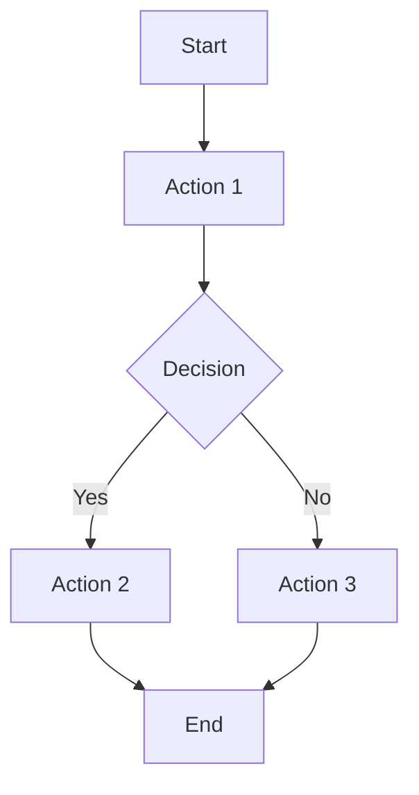

# [Feature Name] - Business Logic & Technical Design

## Overview

[Brief description of the feature, its purpose, and key goals]

---

## Key Business Logic

[Document the core business rules, constraints, and requirements]

### 1. [Business Rule Name]

[Description of the business rule]

**Rationale**: [Why this rule exists]

### 2. [Another Business Rule]

[Description]

**Rationale**: [Why this rule exists]

---

## Backend Technical Design

### API Endpoints

[Document all API endpoints related to this feature]

#### `GET /api/endpoint`
- **Description**: [What this endpoint does]
- **Parameters**: [Query params, path params]
- **Response**: [Response structure]
- **Errors**: [Possible error responses]

#### `POST /api/endpoint`
- **Description**: [What this endpoint does]
- **Request Body**: [Request structure]
- **Response**: [Response structure]
- **Errors**: [Possible error responses]

### Database Schema

[Document database models, relationships, and constraints]

### Business Logic Implementation

[Document how business logic is implemented in services/models]

---

## Frontend Technical Design

### State Management Strategy

[Identify and document all state used in this feature]

#### Server State (API Data)
- [ ] **Data Source**: [Which API endpoints provide data]
- [ ] **React Query Hooks**: [List query hooks to create]
  - `use[Feature]Query()` - [Description]
  - `use[Feature]Mutation()` - [Description]
- [ ] **Query Keys**: [Document query key structure]
  - Example: `['feature-name', clinicId, filters]`
- [ ] **Cache Strategy**: 
  - `staleTime`: [How long data is fresh]
  - `cacheTime`: [How long to keep in cache]
  - Invalidation triggers: [When to invalidate cache]

#### Client State (UI State)
- [ ] **Zustand Store**: [Which store(s) to use or create]
  - State properties: [List state properties]
  - Actions: [List actions/methods]
- [ ] **Local Component State**: [useState for simple component state]
  - [Component name]: [State variables]

#### Form State
- [ ] **React Hook Form**: [If forms are involved]
  - Form fields: [List form fields]
  - Validation rules: [Validation requirements]
  - Default values: [Default form values]

### Component Architecture

[Document component structure and hierarchy]

#### Component Hierarchy
```
[ParentComponent]
  ├── [ChildComponent1]
  │   ├── [GrandchildComponent1]
  │   └── [GrandchildComponent2]
  └── [ChildComponent2]
```

#### Component List
- [ ] **[ComponentName]** - [Purpose/Description]
  - Props: [Props interface]
  - State: [State variables]
  - Dependencies: [Other components/hooks used]

### User Interaction Flows

[Document step-by-step user flows]

#### Flow 1: [Flow Name]
1. [Step 1 description]
2. [Step 2 description]
3. [Step 3 description]
   - Edge case: [What happens if...]
   - Error case: [What happens on error...]

#### Flow 2: [Another Flow]
[Similar structure]

#### Mermaid Diagram (Optional)


### Edge Cases and Error Handling

[Document all edge cases and error scenarios]

#### Edge Cases
- [ ] **Race Condition**: [Scenario description]
  - **Solution**: [How to handle it]
- [ ] **Concurrent Updates**: [Scenario description]
  - **Solution**: [How to handle it]
- [ ] **Clinic Switching**: [What happens when user switches clinic]
  - **Solution**: [How to handle it]
- [ ] **Network Failure**: [What happens on network error]
  - **Solution**: [How to handle it]
- [ ] **Component Unmount**: [What happens if component unmounts during async operation]
  - **Solution**: [How to handle it]

#### Error Scenarios
- [ ] **API Errors**: [4xx, 5xx errors]
  - **User Message**: [What to show to user]
  - **Recovery Action**: [How user can recover]
- [ ] **Validation Errors**: [Form validation errors]
  - **User Message**: [What to show to user]
  - **Field-level Errors**: [Which fields show errors]
- [ ] **Loading States**: [What to show during loading]
  - **Initial Load**: [Loading state]
  - **Refetch**: [Background refetch state]
  - **Mutation**: [Loading state during mutation]

### Testing Requirements

[Document testing requirements for this feature]

#### E2E Tests (Playwright)
- [ ] **Test Scenario**: [User flow to test]
  - Steps: [List test steps]
  - Assertions: [What to verify]
  - Edge cases: [Edge cases to test]
- [ ] **Test Scenario**: [Another user flow]
  - [Similar structure]

#### Integration Tests (MSW)
- [ ] **Test Scenario**: [Component interaction to test]
  - Mock API responses: [What to mock]
  - User interactions: [What to simulate]
  - Assertions: [What to verify]

#### Unit Tests
- [ ] **Component**: [Component to test]
  - Test cases: [List test cases]
- [ ] **Hook**: [Hook to test]
  - Test cases: [List test cases]
- [ ] **Utility**: [Utility function to test]
  - Test cases: [List test cases]

### Performance Considerations

[Document performance requirements and optimizations]

- [ ] **Data Loading**: [How to load data efficiently]
- [ ] **Caching**: [Caching strategy]
- [ ] **Optimistic Updates**: [If using optimistic updates]
- [ ] **Lazy Loading**: [If components should be lazy loaded]
- [ ] **Memoization**: [If components should be memoized]

---

## Integration Points

[Document how this feature integrates with other parts of the system]

### Backend Integration
- [ ] Dependencies on other services
- [ ] Database relationships
- [ ] API contracts

### Frontend Integration
- [ ] Shared components used
- [ ] Shared hooks used
- [ ] Shared stores used
- [ ] Navigation/routing changes

---

## Security Considerations

[Document security requirements]

- [ ] Authentication requirements
- [ ] Authorization checks
- [ ] Input validation
- [ ] XSS prevention
- [ ] CSRF protection

---

## Migration Plan (if applicable)

[If this is a migration or refactoring, document the plan]

### Phase 1: [Phase description]
- [ ] Task 1
- [ ] Task 2

### Phase 2: [Phase description]
- [ ] Task 1
- [ ] Task 2

---

## Success Metrics

[How to measure success of this feature]

- [ ] Metric 1: [Description]
- [ ] Metric 2: [Description]

---

## Open Questions / Future Enhancements

[Document any open questions or future improvements]

- [ ] Question 1
- [ ] Future enhancement 1

---

## References

[Links to related documents, APIs, or resources]

- [Related design doc](./related_doc.md)
- [API documentation](link)
- [External resource](link)

